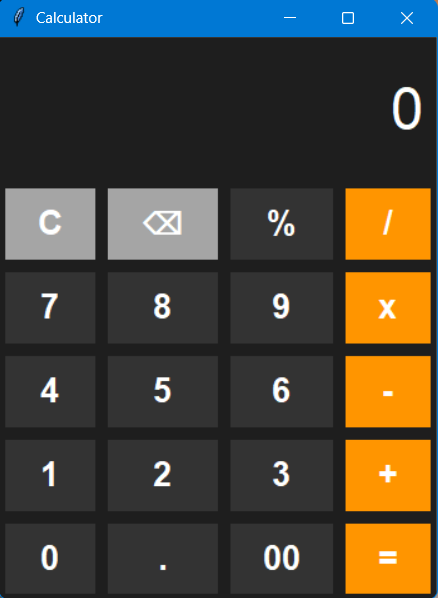
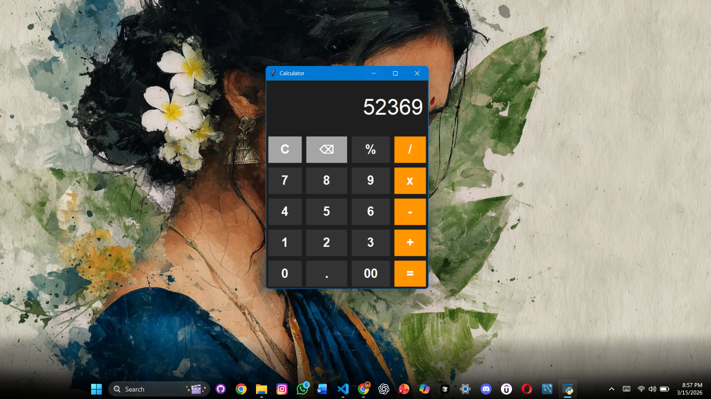

# Advanced Python GUI Calculator

This is an improved version of my basic calculator project.  
It includes a better UI design and additional functionality.

## Features
- Modern dark theme interface
- Backspace button
- Keyboard input support
- Error handling
- Cleaner code structure
- Dynamic button generation

## Technologies Used
- Python
- Tkinter

## Screenshot

## Improvements Over Basic Version
- Better UI design
- More user-friendly interaction
- Improved code structure
- Additional functionality like backspace and keyboard support

This version demonstrates my progress in Python GUI development.
